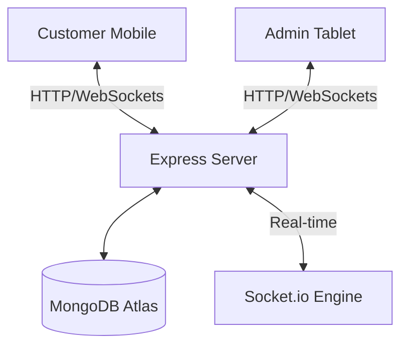
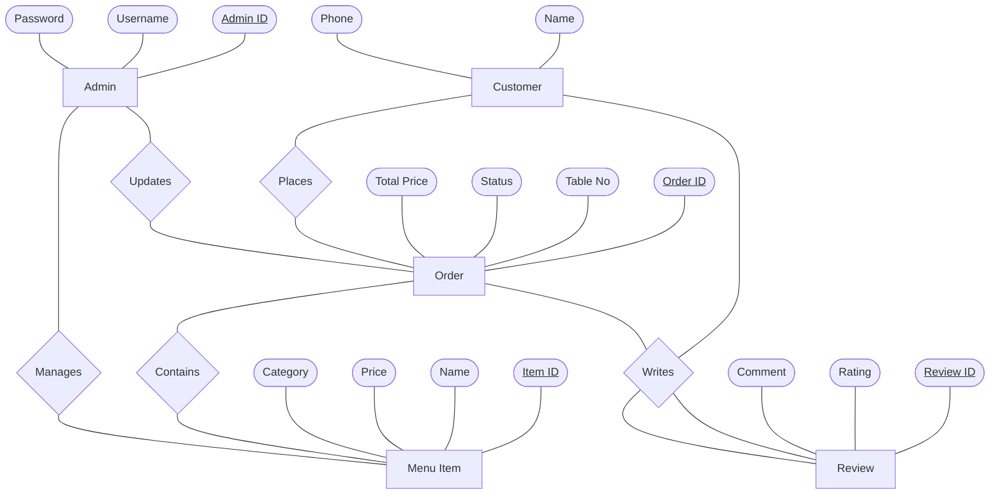
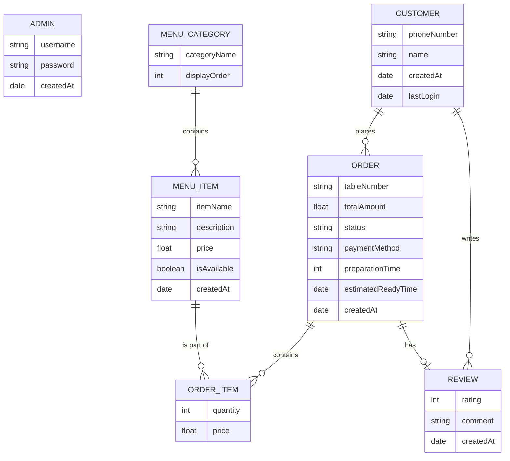

# Documentation: Ali Halal Restaurant Digital Menu System

## 1. Project Overview
The **Ali Halal Restaurant Digital Menu System** is a sophisticated full-stack web application designed to modernize the dining experience. Built on the **MERN (MongoDB, Express, React, Node.js)** stack, the platform facilitates a seamless transition from traditional paper menus to a dynamic, real-time digital interface.

The project is structured into two primary modules: a customer interface and an administrative dashboard. **Customers** can browse a comprehensive digital menu, read/submit reviews, and manage orders through an intuitive cart system. A standout feature is the integration of **Socket.io**, which provides live order status updates, ensuring diners are informed from preparation to service in real-time. Additionally, the system incorporates customized **UPI/GPay deep linking** for effortless digital payments and customer name tracking to enhance service personalization.

---

## 2. Module Descriptions

### **A. Customer Module**
The Customer Module is designed as a lightweight, QR-code-accessible web interface that eliminates the friction of traditional ordering. It begins with a **User Authentication and Profile** sub-module, which captures essential customer details to personalize the experience. The **Digital Menu & Discovery** sub-module provides an interactive catalog where users can filter by categories and view high-quality item details. 

Central to the customer experience is the **Cart & Order Management** logic, which allows for dynamic quantity adjustments and real-time total calculations. Integrated with **UPI and Digital Payment gateways**, it ensures secure transactions without app downloads. Finally, the **Real-Time Tracking & Feedback** sub-module uses WebSocket technology to push live updates from the kitchen to the user's screen.

### **B. Admin Module**
The Admin Module serves as the command center for restaurant operations. Its core is the **Live Order Dashboard**, a high-concurrency interface that displays incoming orders in real-time, allowing staff to update statuses from "Preparing" to "Served." The **Inventory & Menu Management** sub-module provides a CRUD suite for administrators to modify prices, toggle item availability, and update categories instantly across the platform.

---

## 3. Aim of the Work
The primary objective of this project is to engineer a comprehensive **Digital Menu and Order Management System** that revolutionizes the traditional dining workflow into a high-efficiency, technology-driven ecosystem. 

### **System Quality Attributes**
*   **Reliability**: Utilizes MongoDB's document-based storage to ensure data integrity during concurrent order placements.
*   **Availability**: Designed for high uptime with QR-code access and automatic Socket.io reconnection logic.
*   **Security**: Features strict Admin Authentication and leverages UPI deep-linking to avoid storing sensitive payment info locally.
*   **Maintainability**: Follows a modular Component-Based Architecture in React and MVC pattern in the Backend for easy updates.

---

## 4. Background Study
The hospitality industry is undergoing a digital transformation. Traditionally, the restaurant experience relied on physical menus and manual coordination, which suffered from inefficiencies like order errors and delayed communication. Recent studies highlight that modern diners prefer self-service discovery and transparent updates. This project addresses these needs by leveraging the **MERN stack** to create a unified digital ecosystem with **Real-Time WebSockets** and **UPI payment flows**.

---

## 5. Existing System & Problem Analysis

### **Existing System Study**
The current system relies on a **manual, paper-based workflow**. Waitstaff take orders with pen and paper, carry slips to the kitchen, and payments are handled manually via cash or card machines.

### **Drawbacks in the Existing System**
1.  **High Rate of Human Error**: Handwritten orders are prone to misinterpretation.
2.  **Increased Wait Times**: Manual order-taking and delivery to the kitchen creates delays.
3.  **Inflexibility**: Physical menus cannot be updated instantly.
4.  **Lack of Transparency**: Customers have no visibility into order status.
5.  **Payment Friction**: Manual billing often leads to long wait times.

---

## 6. System Analysis

### **Functional Requirements**
*   **Menu Interaction**: Scan QR to view categorized menu.
*   **Order Placement**: Add to cart and submit orders.
*   **Real-Time Status**: Push live updates to customers.
*   **Admin Dashboard**: Manage live orders and menu stock.

### **Feasibility Study**
*   **Technical**: MERN stack provides a robust, high-concurrency environment.
*   **Operational**: Mirrors traditional workflows for intuitive staff use.
*   **Economic**: Reduces paper waste and labor overhead.

---

## 7. Proposed System Outline
The proposed system is a strategic technological upgrade that synchronizes front-end customer actions with back-end operations instantaneously using **Socket.io**. It eliminates hardware friction (BYOD) and provides dynamic inventory control.

---

## 8. System Study and Design

### **Architecture**
The project follows a **Client-Server Architecture**:


### **Database Schema**
*   **Menu**: `_id, name, price, description, category, image, isAvailable`.
*   **Order**: `_id, customerName, phone, tableNumber, items, totalPrice, status`.

---

## 9. UML Diagrams

### **Use Case Diagram**
```mermaid
useCaseDiagram
    actor Customer
    actor Admin
    package "Digital Menu System" {
        usecase "Scan QR" as UC1
        usecase "Browse Menu" as UC2
        usecase "Place Order" as UC3
        usecase "Track Status" as UC4
        Admin --> UC3
        Admin --> UC4
    }
```

### **Sequence Diagram (Order Flow)**

---

## 10. Conceptual ER Diagram (Chen Notation Style)

This diagram strictly follows the conceptual modeling standard: **Rectangles** for Entities, **Diamonds** for Relationships, and **Ovals** for Attributes.



---

## 11. Design Process

The design process for the Ali Halal Restaurant Digital Menu System followed a systematic approach to ensure both technical robustness and a high-quality user experience.

### **A. Database Design**
The database design is centered on a document-oriented model using MongoDB, chosen for its flexibility in handling evolving data structures like menu items and complex order hierarchies. The schema design focuses on balancing data normalization with performance. For instance, while `MenuItem` and `Order` are separate collections, `OrderItem` is embedded within the `Order` document to capture a point-in-time snapshot of prices and quantities, ensuring historical accuracy even if the menu changes later. 

Relationships are managed via Mongoose ObjectIDs, linking customers to leurs orders and reviews. The **ER Diagram** below illustrates the core entities (Admin, Customer, MenuCategory, MenuItem, Order, and Review) and their interconnections. This structured approach allows the system to maintain high integrity across concurrent operations, such as multiple diners placing orders simultaneously. The design also prioritizes scalability, ensuring that as the restaurant's menu grows or customer volume increases, the document-based storage can scale horizontally without the rigid constraints of a traditional relational database.



### **B. Input Design**
The input design for this system is split into two distinct user journeys, each optimized for its specific environment. For the **Customer Side**, the primary goal is "frictionless input." The interaction begins with a QR code scan, which serves as a passive input for the table number. From there, the UI minimizes typing; customers select items via touch-optimized cards, use stepper controls for quantities, and add items to a persistent cart. The only mandatory text input is the customer’s name and phone number during the initial session setup, which is validated to ensure order accountability. For payments, the system leverages UPI deep-linking, which prepopulates payment details (VPA, amount, and transaction notes) in the user's preferred banking app, reducing human error in financial transactions.

On the **Admin Side**, the input design shifts toward efficiency and precision. The Admin Dashboard uses structured forms for menu management, where fields are clearly labeled and include data validation (e.g., ensuring prices are positive numbers). The "Live Order" interface uses button-based state transitions (e.g., clicking "Prepare" or "Ready") to update order statuses, which minimizes the cognitive load on busy restaurant staff. Special attention was paid to real-time feedback; as administrators input changes—like toggling an item’s availability—the system uses WebSockets to broadcast these updates immediately, ensuring that at no point does a customer attempt to order an out-of-stock item. This dual-layered input strategy ensures that data entering the system is accurate, consistent, and easy to provide for both tech-savvy customers and busy employees.

### **C. Output Design**
The output design focuses on delivering real-time, actionable information tailored to the viewer. For **Customers**, the output is highly visual and status-driven. The digital menu serves as the primary output, displaying high-quality imagery and pricing. Once an order is placed, the "Live Tracking" screen becomes the focal output, using progress bars and status badges (e.g., "In the Kitchen," "Ready for Pickup") to keep the user informed. These updates are pushed via WebSockets, eliminating the need for page refreshes.

For the **Administrators**, the dashboard provides a high-level operational overview. The main output is the "Live Orders Table," which prioritizes urgent notifications through color-coding and chronological sorting. Additionally, the system generates "Status Summaries" to help staff track kitchen performance. All outputs are designed to be responsive, ensuring that themes, fonts, and layouts remain legible whether viewed on a kitchen tablet, a mobile phone, or a desktop computer. This ensures that the digital output effectively replaces the traditional paper slip system with a more reliable and transparent communication channel.

